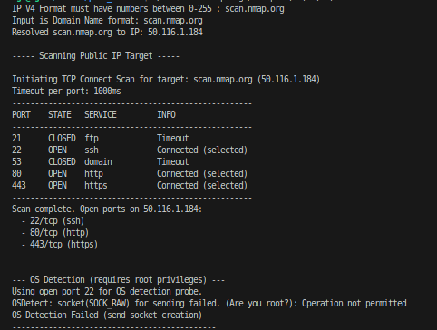

# 🔍 C++ Port Scanner

A simple and efficient port scanner written in C++. This tool allows scanning a target IP address or domain for open TCP ports in a given range.

## 📦 Features

- Scans TCP ports within a specified range with TCP Connection Scanning technique. Other techniques (UDP Scan, TCP Syn Scan, TCP Ack Scan) did not include yet.
- Command-line interface for flexibility.
- Structured with modular C++ source files.

> ⚠️ Note: This project does **not** currently use multithreading.

## 🛠️ Build Instructions
```bash
git clone https://github.com/yourusername/port_scanner.git
cd port_scanner
make
```

## 🚀 Usage

```bash
    ./executable_file <target_ip/domain_name> </CIDR> [-p ports] [-t time-out] -tc
```

### Example

```bash
./scan scan.nmap.org /32 -p 21,22,53,80,443 -t 1000 -tc
./scan 192.168.1.1 /16 -p 20-150 -t 1000 -tc
./scan 127.0.0.1 /8 -p 20-150 -t 1000 -tc
```

## 🖼️ Screenshot
```bash
./scan scan.nmap.org /32 -p 21,22,53,80,443 -t 1000 -tc
```


## 📄 License

This project is licensed under the MIT License.
